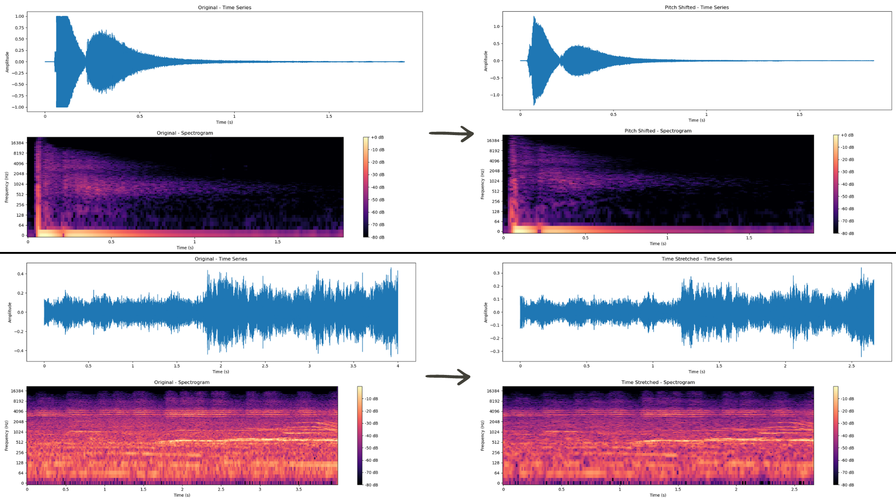
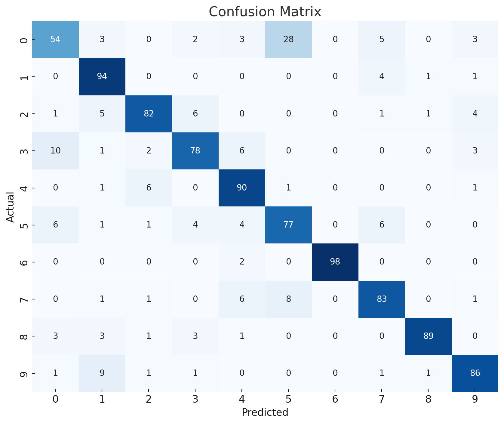

# Project: Training CNN Model on Ubuntu with GPU and application using Raspberry GUI App

# Introduction
This project is developed as part of our internship research topic at OYAMA INSTITUTE OF TECHNOLOGY under the guidance of Dr. HIRATA Katsumi. It focuses on creating a GUI application for the Raspberry Pi 4 that uses a Convolutional Neural Network (CNN) model to classify environmental sounds based on their spectrograms. The project involves setting up the necessary software environment on Ubuntu 20.04.6 LTS, configuring GPU support, and developing the model and the GUI application.


# User guide

Follow these steps to set up and run the sound classification model(All the details are explained below):

1. **Download Dataset and Apply Data Augmentation**
   - Obtain the UrbanSound8K or ESC50 dataset.
   - Apply data augmentation as needed to enhance the dataset's variability and improve model performance.

2. **Prepare Input Data**
   - Run the script to preprocess the data and generate input for the model:
     ```bash
     python makeinputdata_ps2024.py
     ```
   - Ensure the project structure aligns with the paths specified in the script.

3. **Train the Model**
   - Train the convolutional neural network (CNN) using the preprocessed data:
     ```bash
     python learnmodel_ps2024.py
     ```

You can either use the model on command line or on a GUI:
1. **Classification Without GUI**
   - For classification using the command line:
     ```bash
     python classify_ps2024.py /path/to/wavfile
     ```

2. **Classification With GUI**
   - For classification using the GUI:
     ```bash
     python app.py
     ```


# Table of Contents
1. [Machine](#machine)
   - [Installing Ubuntu (22.04.4 LTS)](#installing-ubuntu-22044-lts)
   - [Configuring Wired Connection on Ubuntu (If You Don't Have WIFI)](#configuring-wired-connection-on-ubuntu-if-you-dont-have-wifi)
   - [Setup Environment for GPU Usage](#setup-environment-for-gpu-usage)
     - [Local Setup](#local-setup)
     - [Virtual Environment Setup (Python 3.9.19)](#virtual-environment-setup-python-3810)
   - [Model](#model)
     - [Data](#data)
     - [Data Preprocessing](#data-preprocessing)
     - [Model Conception](#model-conception)
     - [Model Training](#model-training)
     - [Model Analysis](#model-analysis)
2. [Raspberry](#raspberry)
   - [Using the GUI app](#using-the-gui-app)


# Machine

## Installing Ubuntu 22.04.4 LTS (Jammy Jellyfish)
To set up your machine for this project, you need to install the latest version of Ubuntu, which is 22.04.4 LTS (Jammy Jellyfish). Follow the steps below:

1. **Download Ubuntu 22.04.4 LTS (Jammy Jellyfish)**
   - From the official website: [Ubuntu 22.04.4 LTS](https://releases.ubuntu.com/jammy/)

2. **Create a Bootable USB**
   - Use Rufus for Windows or Balena Etcher for Mac to make your USB bootable with the downloaded ISO file.

3. **Install Ubuntu**
   - Plug the USB into the target machine and start it in BIOS mode (typically by pressing the "Del" key during startup, but this can vary).
   - Set the primary boot device to the USB.
   - Follow the on-screen instructions to install the OS on your machine.

### Additional Steps
   - After the installation is complete, remove the USB drive and restart the machine.
   - Follow any additional on-screen prompts to complete the setup, including creating a user account and setting up your network connection.

By following these steps, you will have the focal version of Ubuntu installed and ready for the next stages of your project setup.


## Configuring Wired Connection on Ubuntu (If You Don't Have WIFI)

1. **Identify Network Interface**
   - Use the command `ip link show` or `ifconfig` to find the name of your network interface.

2. **Create WPA Supplicant Configuration**
   - Create a `wpa_supplicant.conf` file in `/etc/wpa_supplicant/`. (A sample file will be in the repository)

3. **Run WPA Supplicant**
   - Use the command:
     ```sh
     sudo wpa_supplicant -Dwired -ieth0 -c /etc/wpa_supplicant/wpa_supplicant.conf
     ```
     (Replace `eth0` with your network interface name).

## Setup Environment for GPU Usage

### Local Setup

1. **Install GPU Drivers**
   - GPU drivers might be provided with the OS.

2. **Install CUDA, CUDA Toolkits, and cuDNN**
   - Ensure all versions are compatible with each other.

3. **Verify Installations**
   - Check GPU drivers and CUDA availability using:
     ```sh
     nvidia-smi
     ```
   - Check CUDA toolkits with:
     ```sh
     nvcc --version
     ```

4. **Verify TensorFlow GPU Availability**
   - Install TensorFlow if not already installed:
     ```sh
     pip install tensorflow
     ```
   - Run the following Python code:
     ```python
     import tensorflow as tf
     print("Num GPUs Available: ", len(tf.config.list_physical_devices('GPU')))
     ```

### Virtual Environment Setup (Python 3.9.19)

1. **Install Virtualenv and Virtualenvwrapper**
   ```sh
   pip install virtualenv virtualenvwrapper

2. **Manipulate Virtualenv and Virtualenvwrapper**
```sh
mkvenv ml  # Create your environment
workon ml  # Activate your environment
deactivate # Deactivate your environment (when needed)
```

Once you are in your environment (`ml`), install the following using pip:

- matplotlib 3.7.5
- keras 2.9.0
- h5py 3.11.0
- numpy 1.24.3
- pandas 2.0.3
- scikit-learn 1.3.2
- scipy 1.10.1
- seaborn 0.13.2
- tensorflow 2.9.3

You will find the names of all the packages installed in our environment inside the repository (Environment Specs) folder!


## Model

### Data
For data, we used the UrbanSound dataset: [UrbanSound8K](https://urbansounddataset.weebly.com/urbansound8k.html). 
A README file to understand how this dataset is structured is provided in the "Data" folder.

To enhance the robustness and generalization capability of our urban audio classification model, we employed several data augmentation techniques:

- **Pitch Shifting**: Modifying the pitch of audio samples to create variations in frequency content.
- **Noise Injection**: Adding random noise to audio samples to simulate different recording environments.
- **Time Stretching**: Altering the speed of audio playback without affecting the pitch.
- **Volume Changes**: Randomly adjusting the volume levels to create variations in loudness.
- **Shifting**: Shifting the audio in time to create variations in temporal alignment.


1. **Initial Dataset**: The original dataset comprises audio samples categorized into different folders, each representing a distinct sound class.
2. **Augmentation Process**: For each original folder, 7 additional folders containing augmented data were generated. This was accomplished using the `5-data-augmentation.ipynb` notebook.
3. **Expanded Dataset Structure**: The augmentation process expanded the dataset to 80 folders of sounds, with an approximate total of 70,000 audio samples.


The augmentation process was executed using the resources and tools available in the `urban-audio-classifier` repository by Eduardo Garcia Rajo. The specific notebook used for this process is `5-data-augmentation.ipynb`.



### Data Preprocessing

For this part we use the makeinputdata_ps2024.py script which takes .wav formated sound files organized based on the urbansound dataset and we get 10 (classes) collections of spectrograms of the sounds
For each fold, the script performs the following steps:

1. **Setup Directory Path and Initialize Arrays**
   - Sets up the directory path for the fold.
   - Initializes arrays for spectrograms (`spgs`) and labels (`labels`).

2. **Load .wav Files**
   - Loads each `.wav` file using `librosa.load` with the specified sampling frequency.
   - Resizes the signal to the defined duration.

3. **Extract Labels**
   - Extracts the label from the filename of each audio file.

4. **Normalize the Signal**
   - Normalizes the signal to ensure consistent amplitude.

5. **Generate Power Spectrogram**
   - Iterates over time frames.
   - Applies a Blackman window to smooth the signal.
   - Computes the FFT (Fast Fourier Transform).
   - Creates a 2D array of power spectrogram values.

6. **Stack Arrays**
   - Stacks the spectrogram and label arrays to compile the data.

7. **Save Processed Data**
   - Saves the spectrograms and labels in a compressed `.npz` file for each fold.

These steps convert raw audio files into a standardized set of spectrograms, which can be used as input for machine learning models.


### Model Conception


### Model Training:
For the training part we use the script learnmodel_ps2024.py.
The trining process includes:

1. **Set Parameters and Conditions**
   - Set parameters like `IMAGESIZE`, `SAMPLEFREQ`, `NNDROPOUT`, `EPOCHS`, and more.
   - Define the dataset source and frequency scale.

2. **One-Hot Encode Labels**
   - Define a function to one-hot encode the labels.

3. **Check Condition Parameters and Set Output File Names**
   - Set the dataset-specific parameters and check for the correct frequency scale.

4. **Setup Data Directory**
   - Set up the directory names for data and output.
   - Ensure the output directory exists or create it.

5. **Prepare Training and Test Data**
   - Split the dataset into training and test sets based on folds.
   - Load training data and labels, normalize, and apply transformations like Mel scaling if required.
   - Load and preprocess test data similarly.

6. **Build the Convolutional Neural Network**
   - Define the CNN architecture with convolutional layers, batch normalization, activation functions, max pooling, flattening, dense layers, and dropout.
   - Compile the model using the Adam optimizer and set the loss function and metrics.

7. **Train the Model**
   - Fit the model on the training data with specified batch size and epochs.
   - Monitor the training process using callbacks like early stopping, tensorboard, and model checkpoint.

8. **Evaluate the Model**
   - Predict on the test data and compute the confusion matrix.
   - Normalize the confusion matrix and print it.
   - Evaluate the model's performance on the test data and print the accuracy.

9. **Save the Model**
    - Save the trained CNN model and its parameters to a file in the output directory.

These steps train a convolutional neural network (CNN) to classify environmental sounds using the power spectrograms of the sounds.

### Model Analysis




# Raspberry

We have developed a user-friendly Graphical User Interface (GUI) for our sound classification model using the PyQt5 library in Python. This GUI provides a seamless experience for users to interact with our model, offering two primary functionalities:

- To use the app, you will need the PyQt5 library. Install it using:
     ```bash
     pip install PyQt5
     ```

1. **Choosing an Existing .wav File**:
   - Browse and select an existing .wav file.
   - Click the "Recognize" button to process the sound through our pre-trained convolutional neural network (CNN) model.
   - The model analyzes the sound and displays the prediction result within the GUI.

2. **Recording a New Sound Clip**:
   - Record a new 4-second sound clip directly through the GUI.
   - The recorded sound is automatically processed by the model.
   - The prediction result is displayed immediately after the recording is completed.

This intuitive interface simplifies the sound classification process, making it accessible to users with varying levels of technical expertise. By integrating functionalities for selecting and recording sounds, our GUI ensures easy utilization of our sound classification model for various applications, such as environmental sound recognition and audio analysis.

## **Recording Case**
When you click on the "Record" button, a progress bar will appear, indicating that the recording is in progress. Once the recording is complete, the sound clip will automatically be processed through the Convolutional Neural Network (CNN) model. The model will analyze the sound and predict its nature, displaying the result within the GUI.

## **Existing File choice**
When you click on the "Choose File" button, a pop-up window will appear, allowing you to select a .wav file from your system. After selecting your file, click on the "Recognize" button. The sound clip will automatically be processed through the Convolutional Neural Network (CNN) model. The model will analyze the sound and predict its nature, displaying the result within the GUI.


